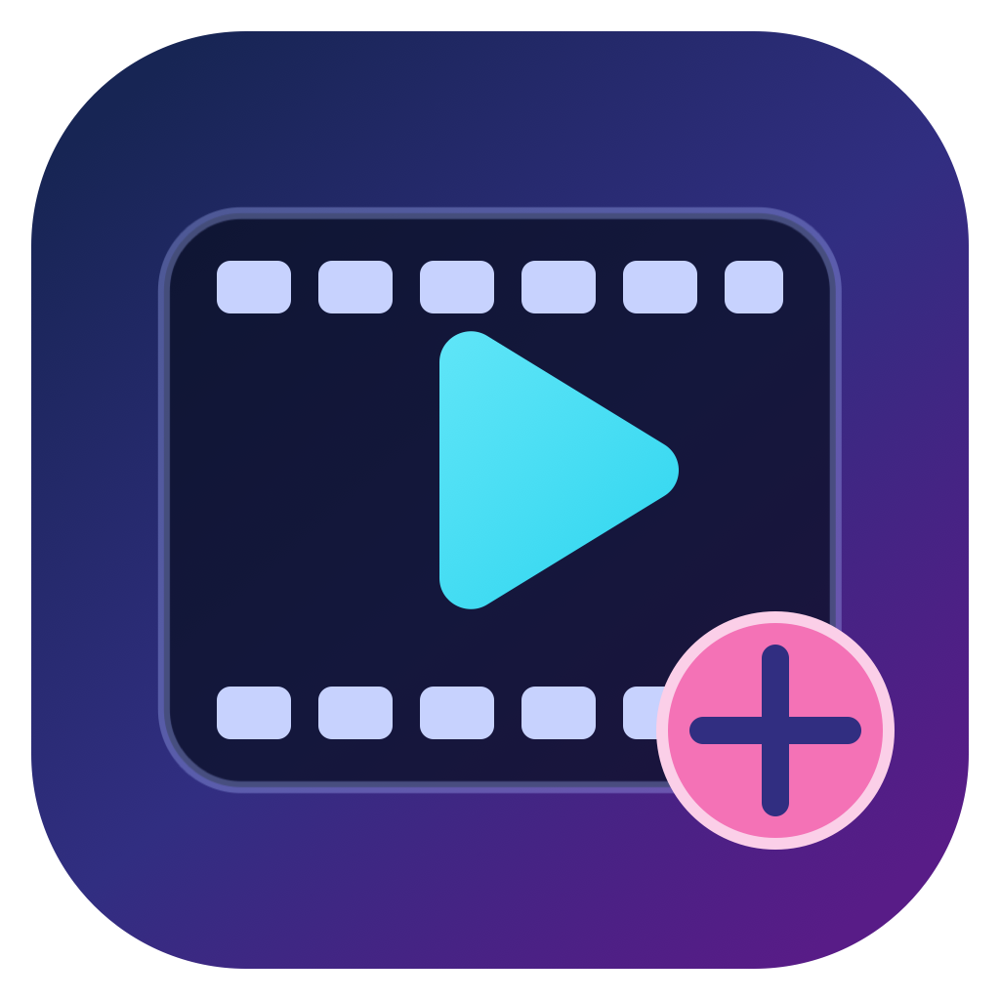
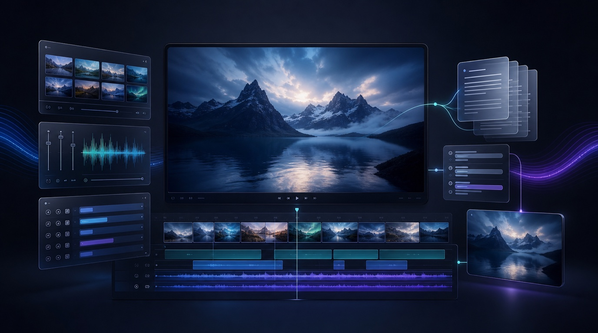
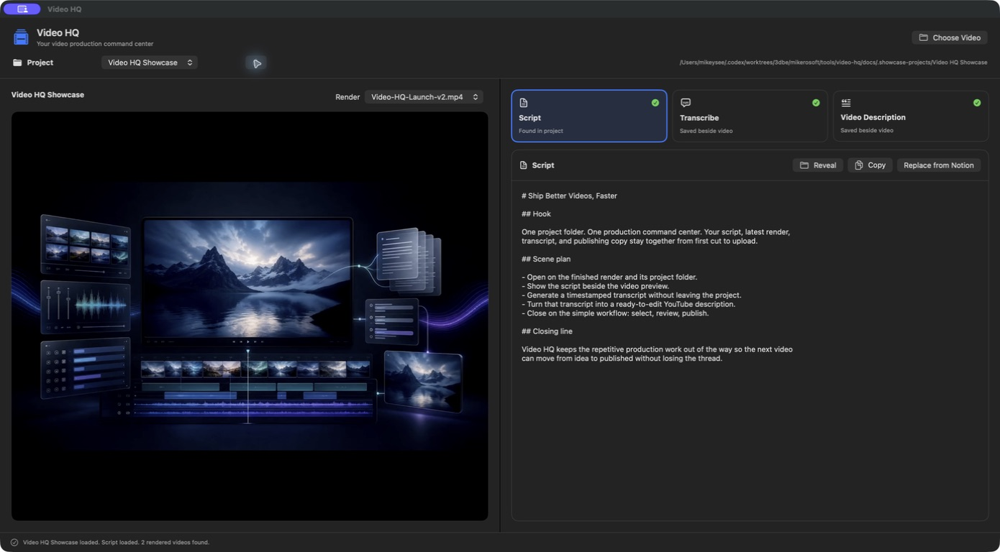
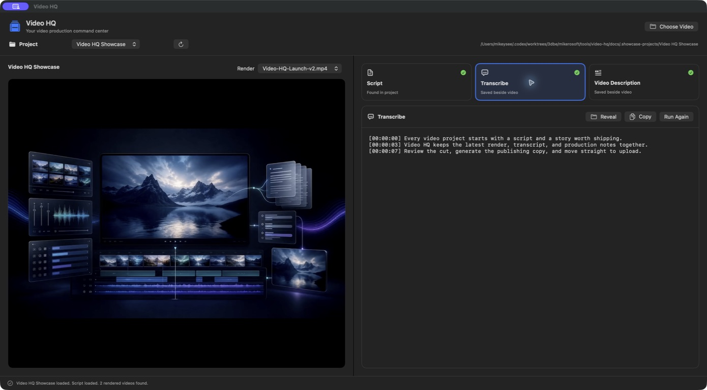
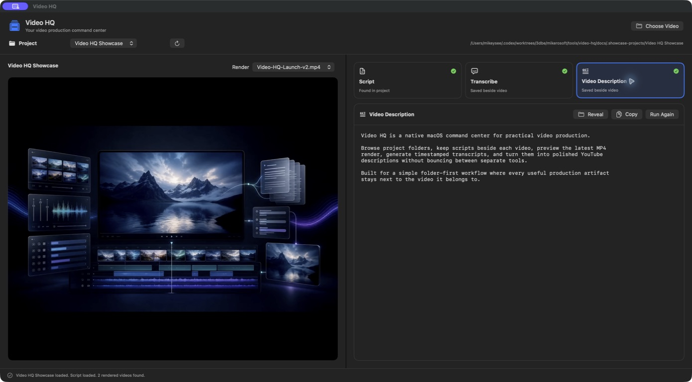

#  video-hq

One place for each video project's script, renders and transcripts

macOS

<!-- media: hero -->
<!--  -->
<!-- media: hero -->



## What it is

This is my command centre for making videos. Each folder in my videos directory is a project, and Video HQ loads its script and previews the rendered MP4s so I'm not hunting around in Finder.

From there I can transcribe a render, generate a YouTube description, pull a script down from Notion, or open it on the Elgato Prompter. There's also a rough cut workspace for working through a raw recording.

## Get it

Paste this into your AI coding agent (Claude Code, Codex, Cursor...):

> Clone https://github.com/mikecann/video-hq and make it my own. It's one of Mike
> Cann's personal tools, so read the README first, change anything specific to his
> setup to suit mine, then help me get it running.

### Or set it up by hand

You'll need macOS 13 or newer and Swift 5.10 or newer from Xcode or Command Line
Tools (`xcode-select --install`). The app fetches
[PrompterKit](https://github.com/mikecann/prompter-kit) through Swift Package Manager.

```bash
git clone https://github.com/mikecann/video-hq.git
cd video-hq
cp .env.example .env
export VIDEO_HQ_PROJECTS_ROOT="$HOME/Movies/Video Projects"
bash install.sh
```

The installer builds, signs, registers and opens `~/Applications/Video HQ.app`,
then symlinks the `video-hq` launcher into `~/.local/bin`. Add that directory to
PATH if the installer tells you to. Pass `--no-open` to install without launching,
or give a different launcher directory: `bash install.sh /your/bin --no-open`.
Re-run after moving the clone. `video-hq build` rebuilds the app.

Browsing projects and previewing scripts and renders need no API keys. To generate
descriptions, put `OPENROUTER_API_KEY` in this clone's `.env`. For Notion search
and download, add `NOTION_API_KEY` (or `NOTION_TOKEN`). Share each script page and
the projects database with your Notion integration and give it read-content access.

Transcription is optional. Install [transcribe](https://github.com/mikecann/transcribe)
and its `ffmpeg`/`faster-whisper` dependencies following that repo's README. Put its
launcher on PATH, or run setup with
`VIDEO_HQ_TRANSCRIBE_EXECUTABLE=/path/to/transcribe/transcribe`. The installed app
remembers that path so transcription also works when you open it from Finder.

## Using it

- **Transcribe** runs the configured `transcribe` launcher
  and saves `<video-name>.srt` beside the video.
- **Video Description** loads that transcript and uses Gemini through OpenRouter
  to save `<video-name>-description.txt` beside the video. If the transcript is
  missing, the app generates it first.
- **Script** loads `script.md`, or another root Markdown/text file with `script`
  in its name. It can search shared Notion pages or accept a Notion page link,
  then download the page as Markdown to `<project>/script.md`. Video HQ records
  the source page ID in YAML front matter, so later downloads become one-click
  syncs from the same Notion page. A Raw/Preview control switches between the
  source text and rendered Markdown. The metadata stays hidden in the app and
  its Teleprompter, which opens large, centered script text on the Elgato
  Prompter display.
- **New Project** is available from the project dropdown. It can create a blank
  local project or start from a project in the Convex Projects Notion database
  whose status is `Writing` or `Ready to Shoot`. The wizard suggests an editable
  kebab-case folder name and downloads Notion content as `script.md`.
- **Rough Cut Process** opens a recording workspace where you can review
  dialogue sections, choose takes, approve joins and plan visuals before exporting
  a new Filmora project.

Existing sidecars are loaded whenever a video is opened. Description files are
compatible with the existing `video-description` CLI chat-log format, and the
app displays its latest Gemini response.

## Rough cut workflow

The Rough Cut Process opens a separate source-recording workspace. It can copy
a recording into the current project's `source` directory, reuse a saved
word-timestamp transcript or SRT, detect silence-delimited sections, and ask
Codex to review the complete transcript for valid sections, false starts, bad
takes, and review items on a playable timeline. When `script.md` exists it is
supplied as optional context, while the recording remains the source of
truth. The same Codex pass also proposes likely joins for interrupted
sentences. The rough-cut screen marks those joins on the timeline and provides the
non-destructive preview, inline approval, rejection, and undo workflow
directly. Dragging across the
analysis timeline continuously scrubs the video and scrolls to highlight the
matching detected section. The multi-select filters can show or hide any
combination of detected types and are saved per analysis. Filtered-out clips
remain faintly visible on the Dialogue track. Clicking a visible row plays
from that clip through the remaining visible sequence with source gaps and
silence skipped. Filters can also show only review items that still need an
explicit decision. Every section has
persistent **Auto**, **Keep**, and **Cut** controls. Step 1 is dedicated to
choosing dialogue clips, resolving review calls, and approving or manually
creating joins. Approved joins
become expandable parent clips in the section list and matching boundaries
for visual planning. Accepted clips can also be selected and joined or
unjoined manually. Expanding a parent reveals its original child clips and
their individual decisions. Merged previews
trim to spoken word edges with small room-tone handles and a 40 ms audio
crossfade, removing the thinking pause without clipping the sentence. Step 2
lists only the accepted clip boundaries and shows the Visuals track above its
Dialogue reference track. Both use the edited programme timeline, with
rejected sections and source-recording gaps removed. Each clip can be assigned a talking-head,
camera-cutout, B-roll, screen-recording, AI B-roll, or screencast layout with
its media reference or generation note. Unassigned clips leave the Visuals
track empty. **Suggest remaining visuals** asks Codex to learn from the
existing human-authored choices and plan only the unassigned clips using the
complete ordered dialogue. Suggested choices are saved with AI provenance,
shown with dashed blocks on the Visuals timeline, and labelled in the clip
list. Editing or applying one converts it into a human-authored choice. This
process is saved beside the analysis. Filmora export
currently writes the reviewed dialogue cut as a separate plan and new `.wfp`.
Video HQ automatically finds a clean single-source Filmora project for the
selected recording, so export only asks for the new project name and location.
It never overwrites the planner output, source project, or an existing project.

## Screenshots

### Script and render workspace



### Timestamped transcript



### YouTube description



## Settings and rough cuts

My project-folder default is `~/dev/convex/convex-videos`. Set
`VIDEO_HQ_PROJECTS_ROOT` before setup to use your own directory. Each direct folder
is a project. The Render picker lists MP4s at that folder's root, leaving recordings
in subfolders out of the list. You can still choose or drag any video manually,
and the app restores the last selected project when you reopen it.

Rough cuts need [automate-filmora](https://github.com/mikecann/automate-filmora),
Python with `faster-whisper`, `ffmpeg`, and a locally signed-in Codex CLI. Set
`VIDEO_HQ_FILMORA_AUTOMATION_ROOT` to that checkout and
`VIDEO_HQ_ROUGH_CUT_PYTHON` to your Python executable before setup. The defaults
are `~/dev/me/automate-filmora` and `~/.local/share/video-hq/venv/bin/python`.
If you already have a media Python environment, point the override at it.

Each run is preserved under the project's `work/video-hq-rough-cut` directory with
its transcript, plan, review report, manual decision sidecar, and versioned
reviewed plans. Filmora export currently creates a new rough-cut project from a
clean source project that Video HQ discovers recursively inside the current
project folder. A recording still needs one Filmora-created clean project before
its first export. Merging into an existing edited project or inserting another
timeline is deliberately not supported until that Filmora operation has its own
controlled before-and-after format experiment.

Setup records these paths in the app bundle. Re-run setup after changing them.
`VIDEO_HQ_DOTENV_PATH` can explicitly select a different credentials file;
otherwise credentials come from this clone's `.env`. Environment variables take
precedence over keys in the file. Keep `.env` private.

The Notion New Project wizard currently uses my Convex Projects data source ID in
`Sources/VideoHQApp/NotionClient.swift`. Change `videoProjectsDataSourceID` and
its status filters for your own database before using that integration.

## Development

```bash
swift test
bash tests/install_test.sh
swift build -c release
bash setup_mac.sh --no-open
bash tests/setup_mac_test.sh
```

The Swift tests use fixture recordings and mocked API responses. The installer
test uses a temporary clone with mocked macOS commands. Neither needs keys,
models or hardware. The final setup test checks an installed app's Launch Services
and Spotlight registration. Prompter placement, real playback and Filmora export
still need checking with the actual display and editor.

## Troubleshooting

If Transcribe reports a missing launcher, install `transcribe` or set
`VIDEO_HQ_TRANSCRIBE_EXECUTABLE` to its full path and re-run setup. The app adds
common Homebrew directories to the child-process PATH for `ffmpeg` and Python.

If a Notion page doesn't appear, check that it is shared with the integration.
If macOS reports a Spotlight indexing timeout during setup, check the staged
bundle and run `bash tests/setup_mac_test.sh` again once indexing catches up.

## More tools

You can find my other tools at [mikerosoft.app](https://mikerosoft.app).

MIT licensed.
